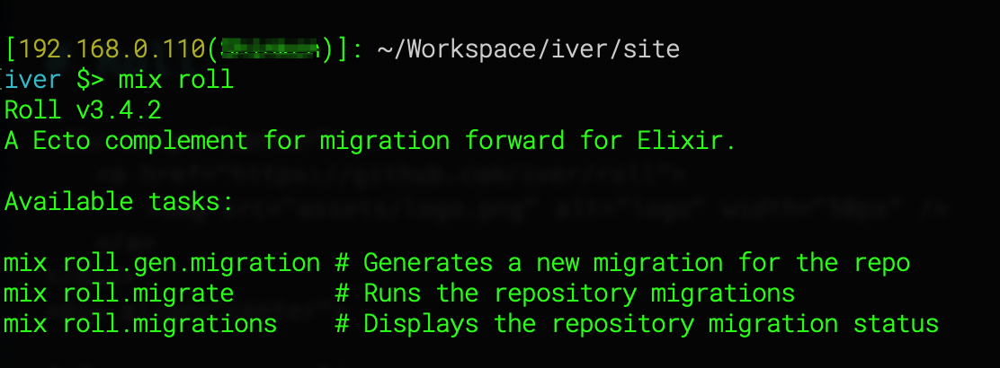

# Roll

<div align="center">
	<a href="https://github.com/iver/roll">
		 
	</a>
</div>
<div align="center">

[](https://coveralls.io/github/iver/roll?branch=master) [](https://travis-ci.org/iver/roll)

</div>

Description
=== 

Library geared toward managing single-run migrations, such as migrating data from one table to another, updating catalogs or maintaining operations.
 
<div align="center">
	 
</div>

Goals
----

* [x] Automate the creation of migrations that are maintenance
* [ ] Recorder when execution begins and ends
* [x] List all migrations and their states


Add to your project
---

It is under construction, but you can add it using as follow:

```elixir
def deps do
  [
    {:roll, git: "git@github.com:iver/roll.git"}
  ]
end
```


## License

Copyright (c) 2020 Iván Jaimes (Iver)

Licensed under the Apache License, Version 2.0 (the "License");
you may not use this file except in compliance with the License.
You may obtain a copy of the License at [http://www.apache.org/licenses/LICENSE-2.0](http://www.apache.org/licenses/LICENSE-2.0)

Unless required by applicable law or agreed to in writing, software
distributed under the License is distributed on an "AS IS" BASIS,
WITHOUT WARRANTIES OR CONDITIONS OF ANY KIND, either express or implied.
See the License for the specific language governing permissions and
limitations under the License.

